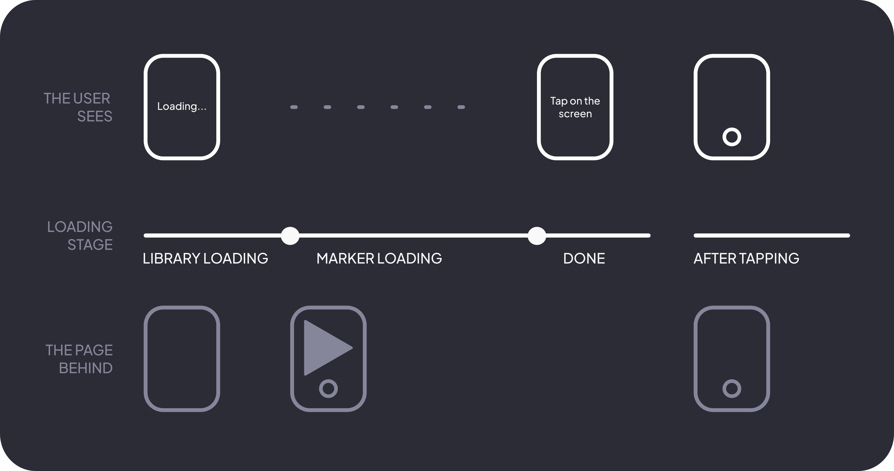

# App overview

The Looking Glass app offers augmented reality features. It's built with AR.js and A-Frame, but no extra UI frameworks.

## Architecture
> A full documentation of custom functions in the app code can be found in the [functions](functions.md) page.
Here are some of the main specifications and flows of the Looking Glass app.

### UI
The UI uses CSS animations and transitions heavily to achieve a smooth look. A lot of the UI is inspired by similar components in the Telegram Android app.

The UI is configured based on initialization data sent by Telegram. `initDataUnsafe` is used because it's easier to access and ensuring that the initialization data came from Telegram isn't as important in this case.

### Loading
The app first shows a black loader over everything. The loader is a `div` with 2 `divs` inside it, making up the loading screens. One of them - with text that shows "loading..." - is shown until all of the required libraries and markers are loaded.

After everything is loaded, the "loading..." screen is hidden, and replaced by another screen. This is done because auto-playing video, which is what AR.js uses to display the camera feed, isn't allowed, and users will see an ugly play icon instead of a camera feed. Video can only be played after the user makes a gesture. However, gestures don't have to be on the player itself, and can happen on other elements. So, a message is shown that asks the user to tap the screen, with an animated circle mimicking a tap motion to make the screen look more interesting visually.

When tapped, the loader disappears with a fade animation, revealing the camera feed, A-Frame scene and shutter button. Eventually it gets removed from the page entirely.

### Shutter button
When this button is pressed, the app covers the UI with a black screen with a message, similar to the loader. This is used to hide a freeze that happens when the photo is taken.

Then, a screenshot of both the A-Frame scene and camera feed is taken. Those screenshots are then merged and sent to the backend along with the initialization data. If you're interested in the details of how the server sends images check out the relevant part in the [backend overview](../server/overview.md).

After a response was received, the screen overlay is hidden and removed, similarly to the loader. A message is shown informing the user if their photo was sent (the request was successful) or not.